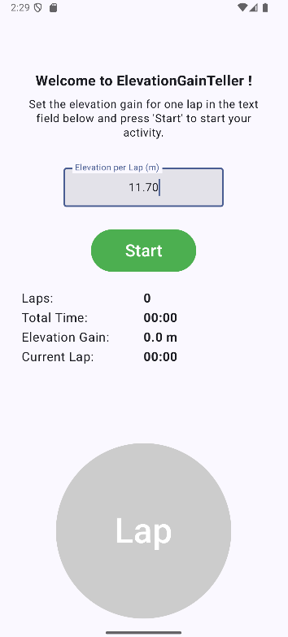
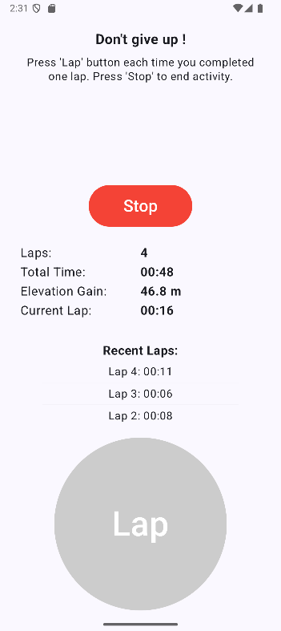
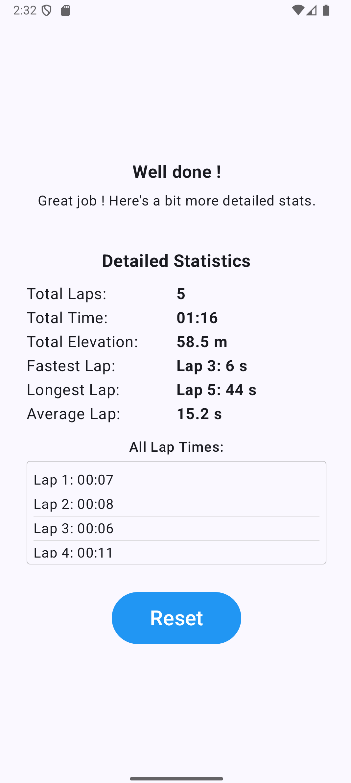

# General description
Mobile application that gives stats when doing several trail run laps.  

# How to use
Set the elevation gain for one single lap.  
Press Start to start the timer. Then start running leaving the phone where you started.  
Press Lap to indicate you just finished one lap. You can see some statistics during the activity between each lap.  
Press Stop to finish your activity and see more detailed statistics.  
Press Reset to come back to the original screen.  

## Some screenshots

